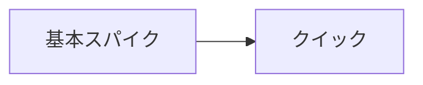
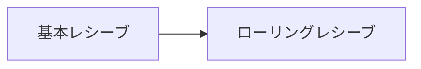

# キャラクター成長過程マップ

## 技術習得ツリー

### アタック系


### レシーブ系


### サーブ系
```mermaid
graph LR
```

### ブロック系
```mermaid
graph LR
```

### トス系
```mermaid
graph LR
```

### 基礎技能系
```mermaid
graph LR
```

## 影響関係マップ

### 技術指導
| 影響元 | 影響先 | 内容 | 結果 |
|--------|--------|------|------|

### 精神的影響
| 影響元 | 影響先 | 内容 | 結果 |
|--------|--------|------|------|

### ライバル関係
| 影響元 | 影響先 | 内容 | 結果 |
|--------|--------|------|------|

### チーム関係
| 影響元 | 影響先 | 内容 | 結果 |
|--------|--------|------|------|
